# Introdução

Informações básicas do projeto.

* **Projeto:** [StartVendas](https://bb9fb5e0-b56f-4bc3-8752-7453f1f1ff2a-00-3bk3rcdhbanjz.spock.replit.dev/)
* **Repositório GitHub:** https://github.com/ICEI-PUC-Minas-PMGCC-TI/atividade-01-dificuldade-de-empresas-com-e-commerce.git
* **Membros da equipe:**

  * [Gabriel Evangelista](https://github.com/GabrielMassara)
  * [Laura Temponi de Lima](https://github.com/lauratemponi)
  * [Letícia Sousa Moreira](https://github.com/leticiamoreiraa)
  * [Luiz Fernando Santos Langa](https://github.com/LuizFSLanga)
  * [Maria Clara Galvão Soares](https://github.com/MariaClara-gs) 
  * [Raphael Caetano Missiaggia](https://github.com/Missiaggia)

A documentação do projeto é estruturada da seguinte forma:

1. Introdução
2. Contexto
3. Product Discovery
4. Product Design
5. Metodologia
6. Solução
7. Referências Bibliográficas

✅ [Documentação de Design Thinking (MIRO)](files/processo.pdf)

# Contexto

Detalhes sobre o espaço de problema, os objetivos do projeto, sua justificativa e público-alvo.

## Problema

**A proposta surge para resolver as dificuldades que pequenos negócios enfrentam ao migrar para o ambiente digital. Muitas dessas empresas, que tradicionalmente operam de forma física,encontram barreiras como a falta de recursos financeiros para investir em soluções tecnológicas, o desconhecimento técnico necessário para criar e manter um site profissional e a dificuldade em conciliar a operação presencial com a gestão de um canal de vendas online. Além disso, desafios relacionados à logística, integração de meios de pagamento digitais e a construção de uma experiência de compra confiável para os clientes também são essenciais. Essa solução abrange pequenos empreendimentos que, mesmo reconhecendo a importância de uma presença digital, dependem de plataformas simples e de baixo custo, sem abrir mão da qualidade e da confiabilidade que seus clientes esperam. A ideia é criar uma infraestrutura baseada em tecnologias amplamente utilizadas e acessíveis.**

## Objetivos

**O objetivo deste trabalho é desenvolver um software que solucione as dificuldades que pequenos negócios enfrentam ao migrar para o ambiente digital. Proporcionar uma plataforma prática e acessível, permitindo que empreendedores criem e gerenciem suas lojas virtuais de forma simples, integrando as operações online e presenciais.** 
**Alguns objetivos específicos são:** 
- **Facilitar a criação de sites e a entrada de comerciantes no mercado digital;**
- **Desenvolver uma plataforma que possibilite aos empreendedores montar suas lojas virtuais de forma simples, reduzindo a dependência exclusiva de redes sociais e de marketplaces para realizar vendas**
- **Implementar funcionalidades que integrem o controle de estoque, pedidos e transações, proporcionando uma gestão mais eficiente e menos burocrática para o negócio**
- **Aumentar o engajamento e a visibilidade do negócio**
- **Incorporar ferramentas que estimulem a interação com os clientes e permitam o monitoramento do desempenho da loja, contribuindo para um maior alcance e fortalecimento da marca no ambiente digital.**

## Justificativa

**O projeto foi escolhido pois, pequenos empreendedores enfrentam desafios significativos para migrar suas atividades para o ambiente digital, como a falta de conhecimento técnico e recursos financeiros para investir em soluções complexas. A função da aplicação é proporcionar uma plataforma simples, intuitiva e completa para que esses empreendedores possam criar, personalizar e gerenciar suas lojas virtuais de forma autônoma. O público-alvo são pequenos empresários que desejam expandir suas vendas e aumentar a visibilidade de seus negócios online, mas que, atualmente, dependem exclusivamente das redes sociais ou de soluções complicadas ou não tão eficientes. Este trabalho se baseia em entrevistas realizadas, bem como na análise das dificuldades enfrentadas por esses profissionais, evidenciadas em pesquisas que apontam a necessidade de uma solução acessível para a transformação digital dos pequenos negócios.**

**Artigo sobre os principais desafios de um e-commerce: https://sebrae.com.br/sites/PortalSebrae/artigos/conheca-os-principais-desafios-do-e-commerce,e7718e029bf28810VgnVCM1000001b00320aRCRD <br> Notícia sobre o crescimento do e-commerce no Brasil: https://valor.globo.com/patrocinado/dino/noticia/2024/04/09/e-commerce-esta-em-crescimento-ha-dez-anos.ghtml**


## Público-Alvo

**A aplicação se direciona principalmente a pequenos empreendedores que desejam criar ou expandir sua presença online. São pessoas que, em geral, não têm grande familiaridade com programação ou ferramentas complexas de e-commerce, mas reconhecem a importância de estar no meio digital para ampliar vendas e consolidar a marca. São pessoas que têm conhecimentos básicos sobre o uso de computadores e celulares, mas muitas vezes enfrentam dificuldades com plataformas digitais mais complexas ou possuem conhecimento intermediário e tem mais facilidade com o uso de tecnologias. São pessoas, tanto jovens quanto mais velhas, que buscam facilidade ao montar um negócio online**


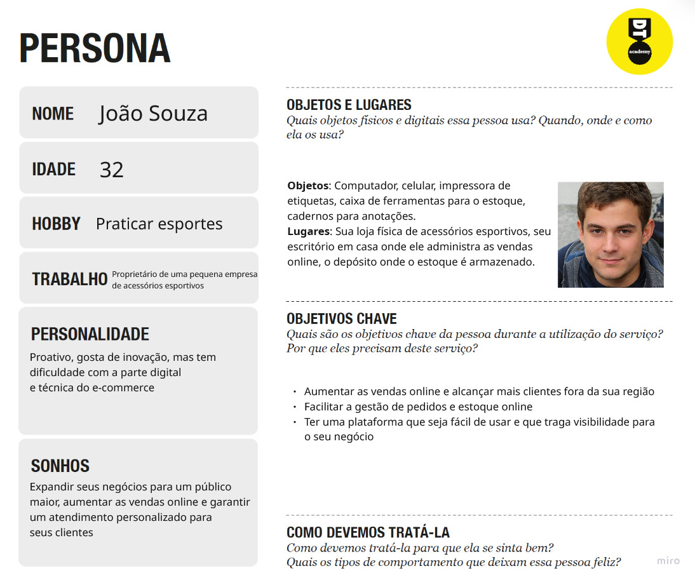

# Product Discovery

## Etapa de Entendimento

### Matriz CSD
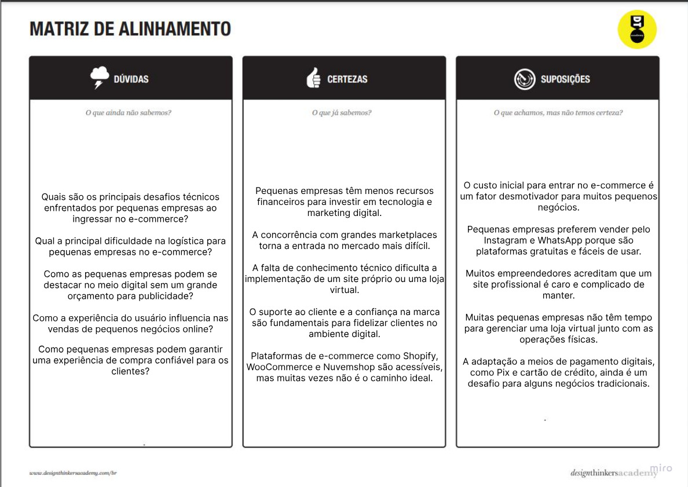

### Mapa de stakeholders
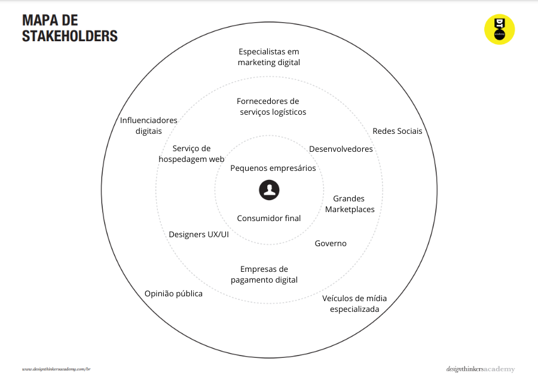

### Entrevistas qualitativas
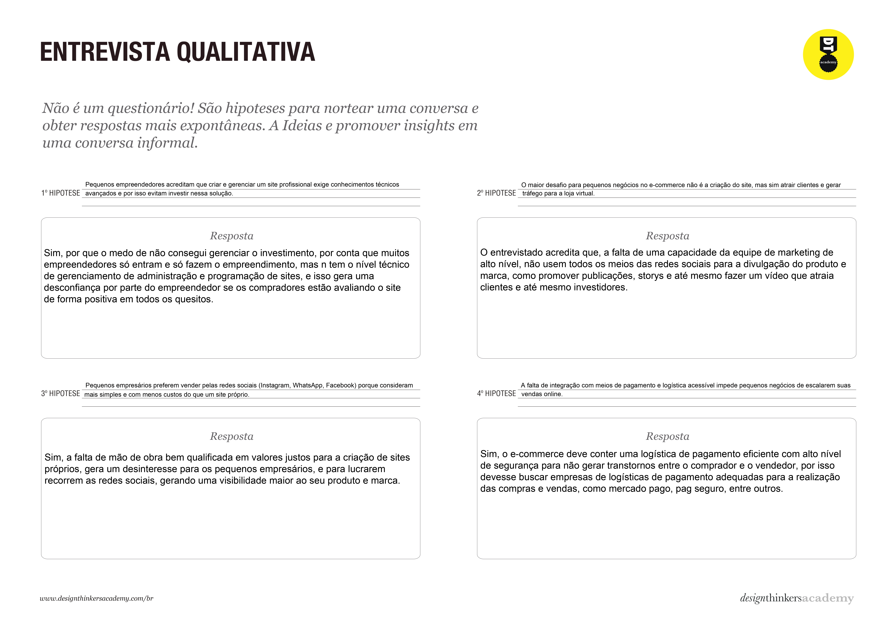 <br>
 <br>
 <br>

### Highlights de pesquisa
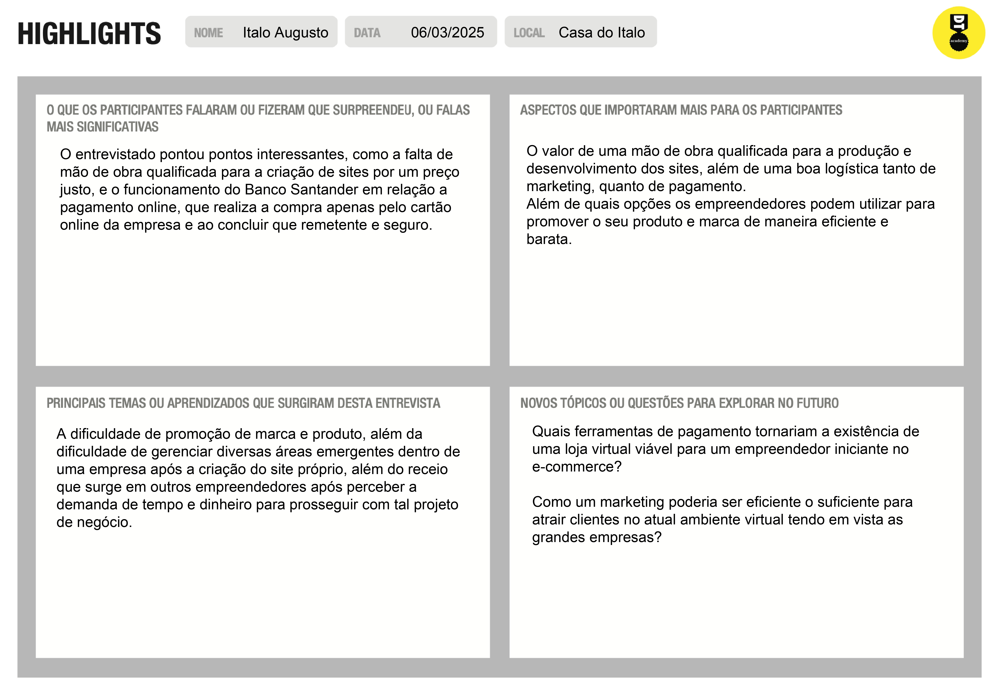 <br>
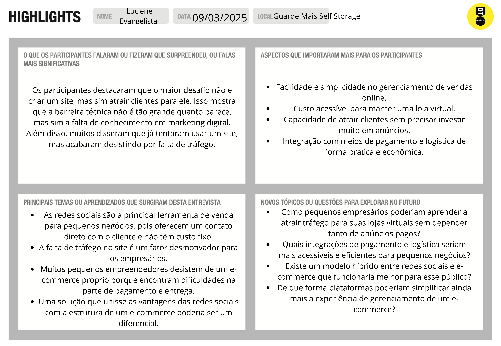 <br>
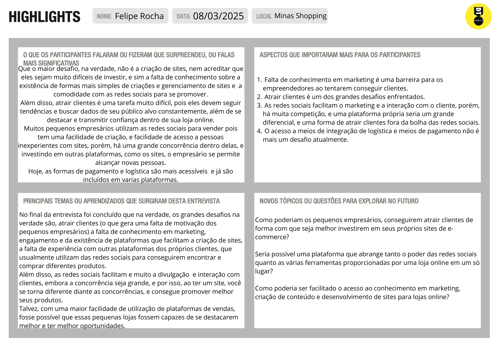 <br>

## Etapa de Definição

### Personas
#### Persona 01: Ricardo Mendes
 <br>
#### Persona 02: Bianca Ramos
<br>
#### Persona 03: João Souza


# Product Design

Nesse momento, vamos transformar os insights e validações obtidos em soluções tangíveis e utilizáveis. Essa fase envolve a definição de uma proposta de valor, detalhando a prioridade de cada ideia e a consequente criação de wireframes, mockups e protótipos de alta fidelidade, que detalham a interface e a experiência do usuário.

## Histórias de Usuários

Com base na análise das personas foram identificadas as seguintes histórias de usuários:

| EU COMO...`PERSONA` | QUERO/PRECISO ...`FUNCIONALIDADE`        | PARA ...`MOTIVO/VALOR`               |
| --------------------- | ------------------------------------------ | -------------------------------------- |
| Dono de uma loja de Artigos esportivos| Promover minha marca sem necessitar de uma loja física| Automatizar e otimizar meu estoque e caixa|
| Dona de uma loja de roupas| Depender menos de diversas plataformas para divulgar minha loja |Otimizar o gerenciamento da loja e aumentar vendas |
| Dono de uma loja de eletrônicos | Expandir meu negócio para novas regiões |Gerenciamento e exposição de meus produtos no meio digital  |
| Dono de uma livraria | Expandir a loja para meios digitais |Atrair mais leitores/clientes |
| Dona de uma loja de acessórios  | Atrair novos clientes sem depender de redes sociais ou recomendações |Facilitar o gerenciamento e marketing, e alcançar novos clientes |
| Dono de uma loja de móveis à mão | Aumentar a influência de sua marca  | Apresentar meu trabalho a novas pessoas por imagens e descrições, e ter maior alcance |
| Dona de uma loja de personalizados | Gerenciar pedidos e divulgar meus produtos | Evitar atrasos nas encomendas e promover minha marca |

## Proposta de Valor

- ##### Proposta de valor para Persona Ricardo Mendes

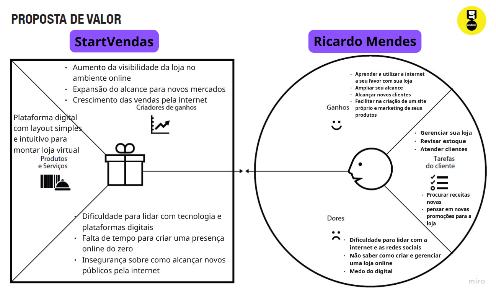 <br>

- ##### Proposta de valor para Persona Bianca Ramos

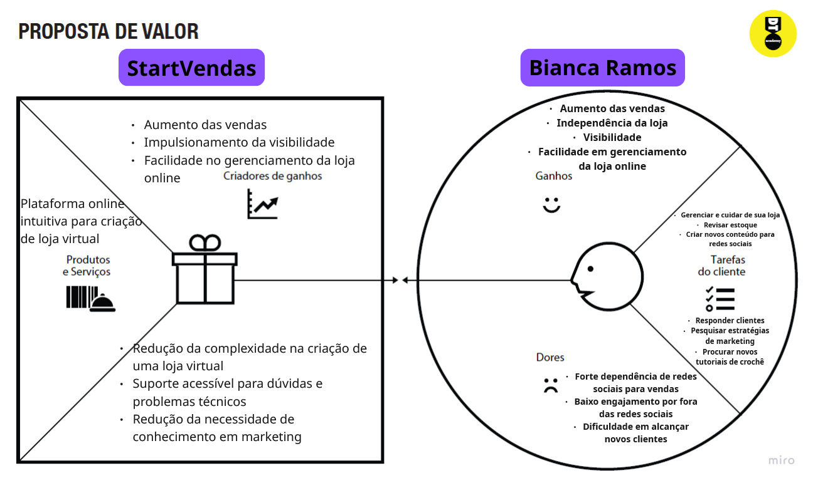 <br>

- ##### Proposta de valor para Persona João Souza

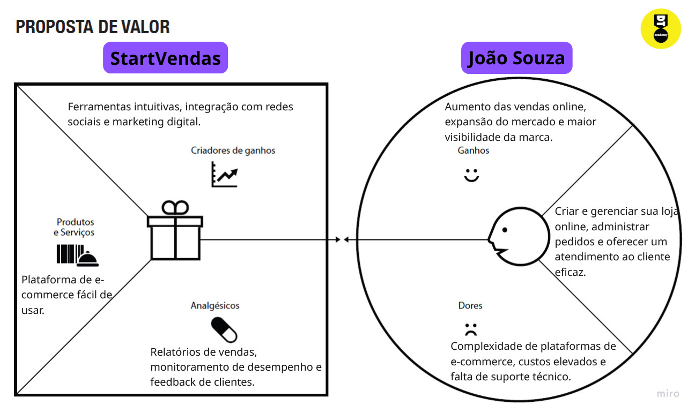

## Requisitos

As tabelas que se seguem apresentam os requisitos funcionais e não funcionais que detalham o escopo do projeto.

### Requisitos Funcionais

| ID     | Descrição do Requisito                                   | Prioridade |
| ------ | ---------------------------------------------------------- | ---------- |
| RF-001 | Permitir o cadastro da loja armazenando os seguintes dados: nome, descrição,  informações (exemplo CNPJ), dados de personalização (exemplo ícone da loja, banner, etc) | ALTA       |
| RF-002 | Cadastro de produtos referentes a loja, armazenando informações como nome, descrição, imagens, preço | ALTA    |
| RF-003 | Cadastro de usuário para login no sistema | MÉDIA    |
| RF-004 | ⁠Cadastro de clientes para efetuar pedidos | MÉDIA   |
| RF-005 | Cadastro dos pedidos contendo quem comprou e o produto comprado | ALTA   |
| RF-006 | Sistema de transação deve Ter dados armazenados| BAIXA  |

### Requisitos não Funcionais

| ID      | Descrição do Requisito                                                              | Prioridade |
| ------- | ------------------------------------------------------------------------------------- | ---------- |
| RNF-001 | O site deve ser hospedado 24/7 | ALTO    |
| RNF-002 | Deve utilizar versionamento Git | ALTO   |
| RNF-003 | Deve ser hospedado em um sistema cloud | MÉDIA  |
| RNF-004 | Utilização de um banco de dados para armazenar informações (exemplo postgreSQL) | ALTO  |
| RNF-005 | Front-end com Html, css, javascript| ALTO  |
| RNF-006 | Utilizar bootstrap para responsividade| MÉDIA  |
| RNF-007 | Back-end para realizar as operações com o banco de dados (exemplo de linguagem que pode ser utilizada: php)| BAIXA  |

## Projeto de Interface

Artefatos relacionados com a interface e a interacão do usuário na proposta de solução.

### Wireframes

Estes são os protótipos de telas do sistema.

##### TELA HOME PAGE

Tela inicial que o usuário encontrará ao abrir a plataforma. Ela é responsável por apresentar o site para o cliente.

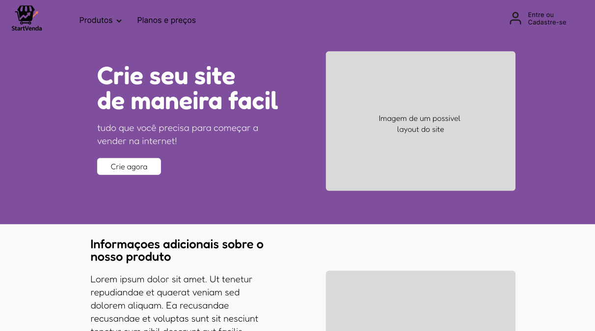

##### TELA LOGIN

Tela em que o usuário ou o lojista poderá fazer login ou clicar para abrir o formulário de cadastro.

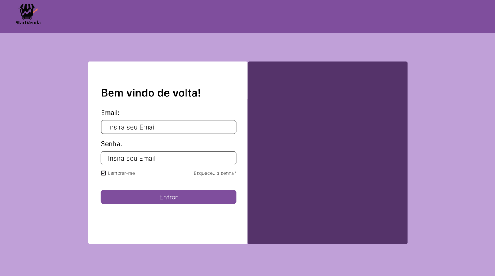

##### TELA CADASTRO

Tela em que o usuário poderá preencher seus dados pessoais e criar sua conta na plataforma.


##### TELA GERAL DAS LOJAS

Nessa parte, o cliente terá uma visualisação de todas as lojas e poderá buscar por produtos específios, filtrando-os por categorias.

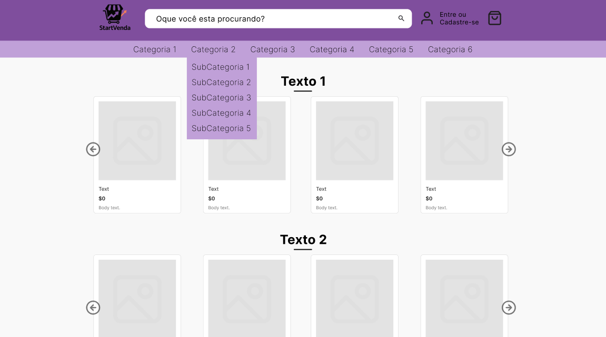

##### TELA DA LOJA

Este é um exemplo de uma loja em específico quando aberta. Nela é possível ver todos os produtos de maneira categorizada.

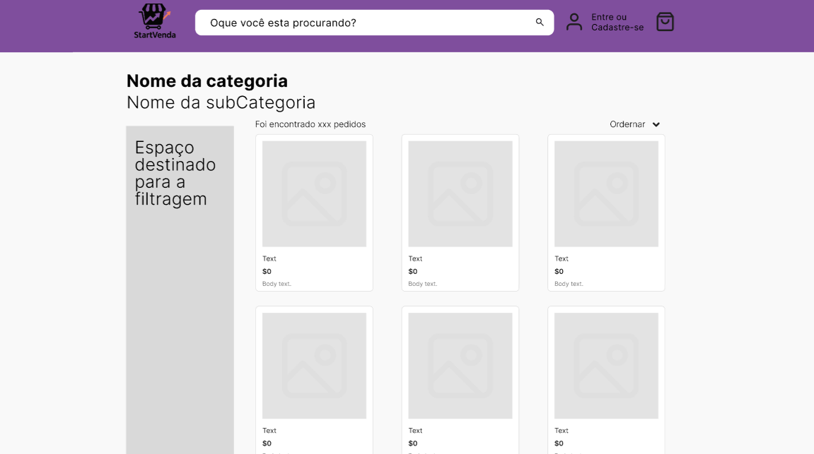

### User Flow

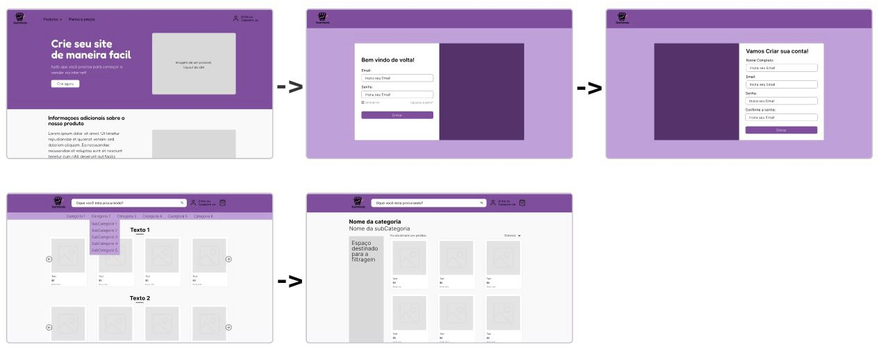


✅ [Protótipo Interativo (Figma)](https://www.figma.com/design/Ox0IaX1kot8kd8fG4I2mh8/startVendas?node-id=0-1&p=f&t=EzMsSPeqr75TKlJE-0)

# Metodologia <!--COMPLETAR TABELA-->

Detalhes sobre a organização do grupo e o ferramental empregado.

## Ferramentas
Relação de ferramentas empregadas pelo grupo durante o projeto.

| Ambiente                    | Plataforma | Link de acesso                                     |       Justificativas    |
| --------------------------- | ---------- | -------------------------------------------------- |---------------|
| Processo de Design Thinking | Miro       | https://miro.com/app/board/uXjVINCB9Qs=/?share_link_id=647376903219      | Permite criar mapas e anotações de forma colaborativa, fazendo com que a equipe seja capaz de trabalhar em conjunto. |
| Repositório de código     | GitHub     | https://github.com/ICEI-PUC-Minas-PMGCC-TI/atividade-01-dificuldade-de-empresas-com-e-commerce.git      | Permite controlar as versões do projeto, salvar na nuvem e permitir com que todos trabalhem em conjunto. | 
| WireFrame                  |  Figma      | https://www.figma.com/design/Ox0IaX1kot8kd8fG4I2mh8/startVendas?node-id=0-1&p=f&t=EzMsSPeqr75TKlJE-0 | Permite planejar e criar as telas do site, antes de começar o projeto. |
| Hospedagem | Replit | https://bb9fb5e0-b56f-4bc3-8752-7453f1f1ff2a-00-3bk3rcdhbanjz.spock.replit.dev/ | Permite hospedar sites e projetos de forma gratuita, rápida e sem configuração complexa.|


## Gerenciamento do Projeto <!--EDITAR-->

Divisão de papéis no grupo e apresentação da estrutura da ferramenta de controle de tarefas (Kanban).

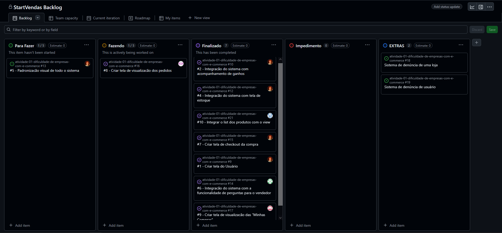

# Solução Implementada

Esta seção apresenta todos os detalhes da solução criada no projeto.

## Vídeo do Projeto
O vídeo a seguir traz uma apresentação do problema que a equipe está tratando e a proposta de solução.

Clique na imagem para acessar o vídeo!
[](https://www.youtube.com/watch?v=4D28yHAWFgg)


## Funcionalidades

Esta seção apresenta as funcionalidades da solução.Info

##### Funcionalidade 1 - Avaliações

Permite que os usuários atribuam uma nota ou deixem um comentário sobre um produto.

* **Estrutura de dados:** [Avaliações](#estrutura-de-dados---avaliações)
* **Instruções de acesso:**
  * Abra o site e efetue o login
  * Clique no produto que deseja avaliar
  * Em seguida, digite sua avaliação no campo de comentário
  * Escolha a quantidade de estrelas na opção abaixo
  * Clique em enviar comentário para finalizar
* **Tela da funcionalidade**:

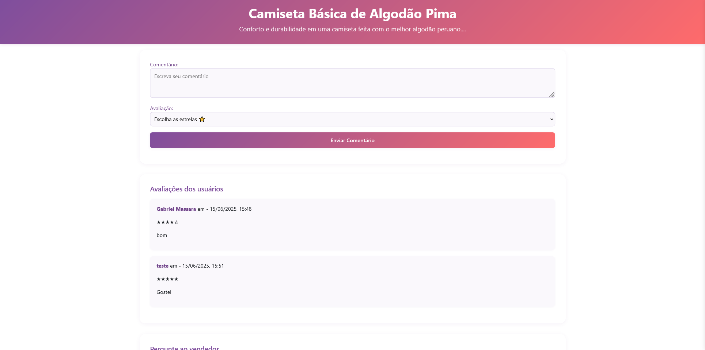

##### Funcionalidade 2 - Cadastro Loja

Permite criar, visualizar, editar e excluir informações de lojas cadastradas no sistema.

* **Estrutura de dados:** [Lojas](#estrutura-de-dados---lojas)
* **Instruções de acesso:**
  * Abra o site e efetue o login
  * Clique na opção Página do Vendedor na Barra de Navegação
  * Clique em cadastrar nova loja
  * Preencha o formulário e salve as informações
* **Tela da funcionalidade**:

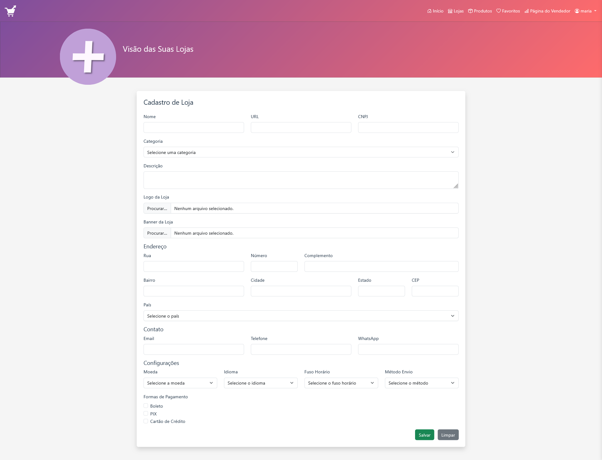

##### Funcionalidade 3 - Carrinho

Permite visualizar, excluir ou realizar compra de produtos adicionados ao carrinho.

* **Estrutura de dados:** [Carrinho](#estrutura-de-dados---carrinho)
* **Instruções de acesso:**
  * Abra o site e efetue o login
  * Na barra de navegação clique no usuário logado
  * Clique na opção Carrinho
* **Tela da funcionalidade**:

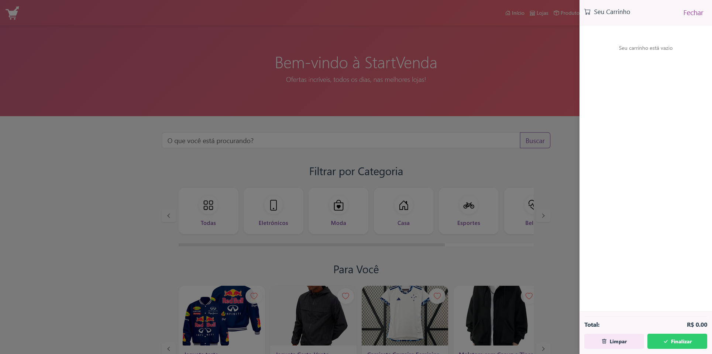

##### Funcionalidade 4 - Chat

Permite a comunicação entre cliente e vendedor durante uma compra.

* **Estrutura de dados:** [Chats](#estrutura-de-dados---chats)
* **Instruções de acesso:**
  * Abra o site e efetue o login
  * Realize a compra de um produto
  * A tela irá redirecionar o usuário para a tela de minhas compras
  * Clique em Ir para Checkout
  * Digite a mensagem e clique no botão para enviar

* **Tela da funcionalidade**:


##### Funcionalidade 5 - Checkout de Pedido

Permite a finalização da compra do usuário, de produtos no carrinho.

* **Estrutura de dados:** [Carrinho](#estrutura-de-dados---carrinho)
* **Instruções de acesso:**
  * Abra o site e efetue o login
  * Escolha um produto para comprar e clique
  * Adicione o produto ao carrinho
  * Clique no usuário na barra de navegação
  * Clique em carrinho
  * Clique em finalizar
  * Ao abrir a tela de checkout, clique em finalizar compra

* **Tela da funcionalidade**:

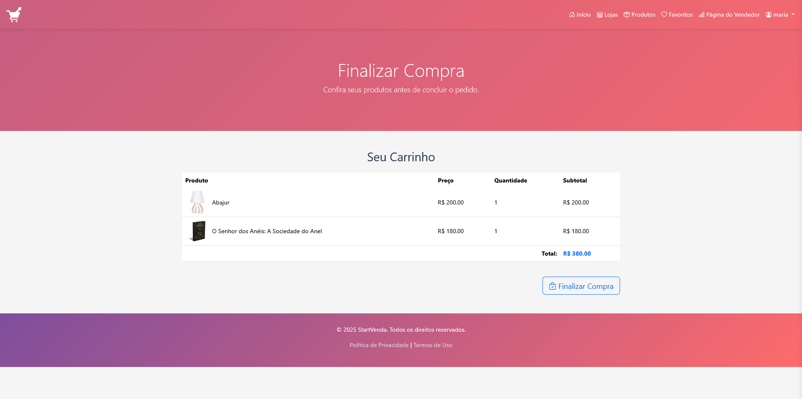

##### Funcionalidade 6 - Gerenciar Lojas

Permite que o usuário gerencie cada uma de suas lojas, e tenha uma visão geral de estoque.

* **Estrutura de dados:** [Lojas](#estrutura-de-dados---lojas) e [Produtos](#estrutura-de-dados---produtos)
* **Instruções de acesso:**
  * Abra o site e efetue o login
  * Clique em Página do vendedor na barra de navegação
  * Clique na loja que deseja gerenciar

* **Tela da funcionalidade**:

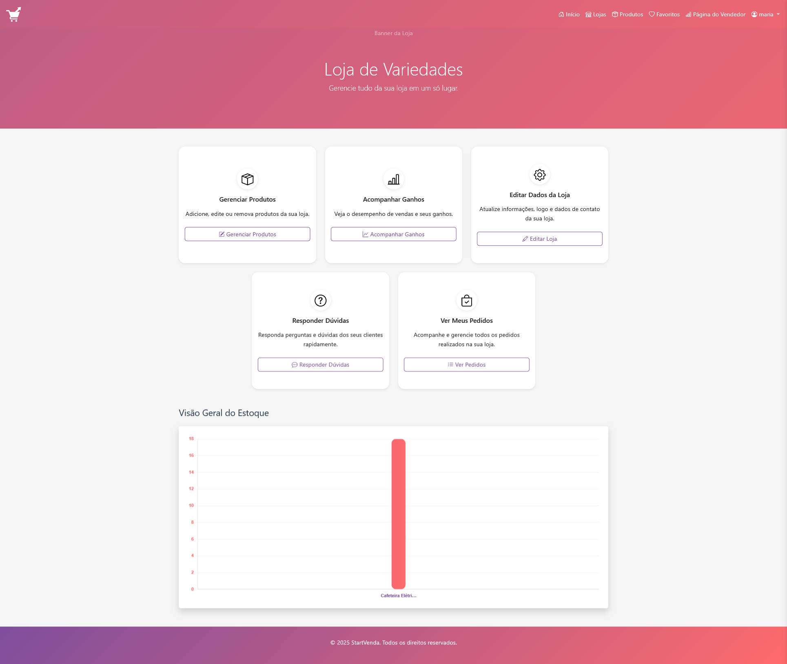

##### Funcionalidade 7 - Tela de favoritos

Permite que o usuário acesse produtos que adicionou na lista da favoritos, e remova itens dessa lista também.

* **Estrutura de dados:** [Favoritos](#estrutura-de-dados---favoritos)
* **Instruções de acesso:**
  * Abra o site e efetue o login
  * Para adicionar produtos aos favritos, clique no ícone de coração vazado que tem em todos os cards de produtos
  * Para desfavoritar clique no botão que estiver com o ícone de coração cheio, nos cards de produtos
  * Para acessar a página de favoritos, clique em Favoritos na barra de navegação

* **Tela da funcionalidade**:

.png)

##### Funcionalidade 8 - Gerenciamento de Ganhos

Permite que o vendedor acompanhe e gerencie seus ganhos por meio de filtros por data, gráficos e indicadores textuais.

* **Estrutura de dados:** [Lojas](#estrutura-de-dados---lojas), [Pedidos](#estrutura-de-dados---pedidos) e [Produtos](#estrutura-de-dados---produtos)
* **Instruções de acesso:**
  * Abra o site e efetue o login
  * Clique em Página do Vendedor na barra de navegação
  * Clique na loja que deseja gerenciar ou crie uma
  * Clique no botão Acompanhar Ganhos

* **Tela da funcionalidade**:

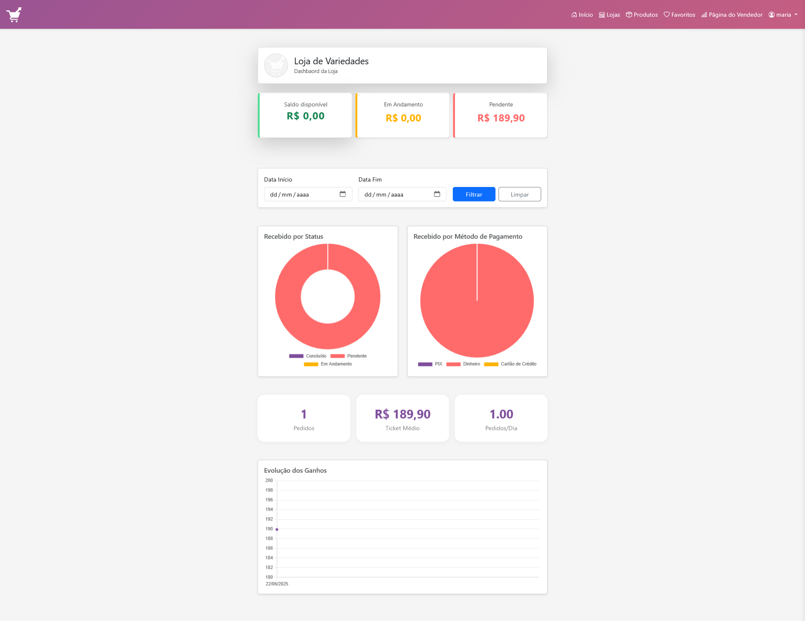

##### Funcionalidade 9 - Login

Permite que o usuário acesse sua conta na plataforma, habilitando funcionalidades como realizar compras, criar e gerenciar lojas, além de acessar outros recursos disponíveis conforme seu perfil.

* **Estrutura de dados:** [Usuários](#estrutura-de-dados---usuários)
* **Instruções de acesso:**
  * Abra o site 
  * Clique em Login na barra de navegação
  * Caso não tenha uma conta clique em Registrar novo usuário, preencha o formulário e clique em Salvar
  * Preencha o formulário de Login e clique no botão Entrar

* **Tela da funcionalidade**:


##### Funcionalidade 10 - Página de Minhas Compras

Permite que o usuário visualize o histórico e o status de seus pedidos, com opção de filtro e acesso ao checkout.

* **Estrutura de dados:** [Pedidos](#estrutura-de-dados---pedidos), [Produtos](#estrutura-de-dados---produtos) e [Usuários](#estrutura-de-dados---usuários)
* **Instruções de acesso:**
    * Abra o site e efetue o login
    * Clique no usuário na barra de navegação
    * Clique em Minhas Compras

* **Tela da funcionalidade**:

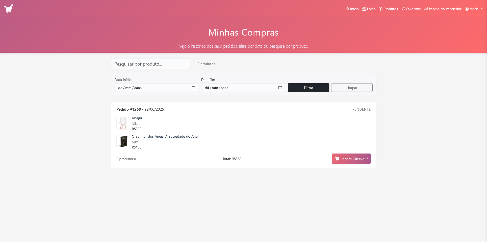

##### Funcionalidade 11 - Gerenciar Pedidos

Permite que o vendedor acompanhe suas vendas, visualize o status dos pedidos, acesse o chat com o cliente e finalize a venda.

* **Estrutura de dados:** [Pedidos](#estrutura-de-dados---pedidos)
* **Instruções de acesso:**
    * Abra o site e efetue o login
    * Clique em Página do Vendedor na barra de navegação
    * Clique na loja que deseja gerenciar
    * Clique no botão Ver Pedidos

* **Tela da funcionalidade**:

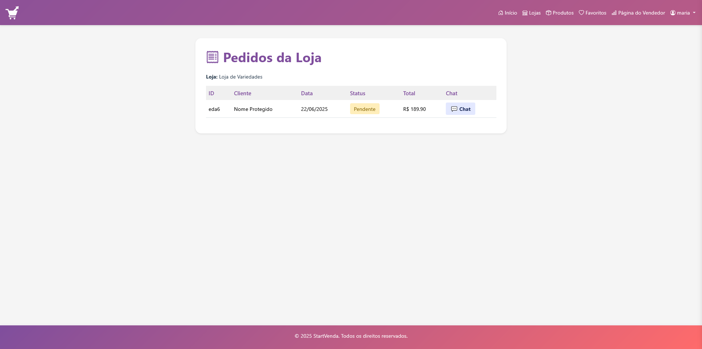

##### Funcionalidade 12 - Gerenciar Produtos

Permite que o vendedor cadastre, edite ou remova produtos da loja, mantendo o catálogo sempre atualizado.

* **Estrutura de dados:** [Produtos](#estrutura-de-dados---produtos)
* **Instruções de acesso:**
    * Abra o site e efetue o login
    * Clique em Página do Vendedor na barra de navegação
    * Clique na loja que deseja gerenciar
    * Clique no botão Gerenciar Produtos

* **Tela da funcionalidade**:

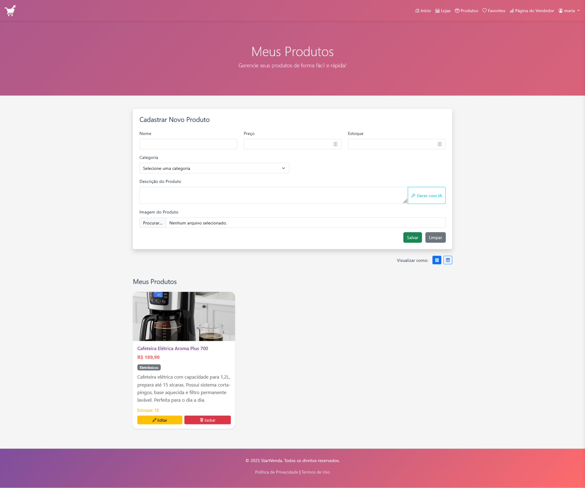

##### Funcionalidade 13 - Página da Loja

Permite que o usuário acesse a página da loja e visualize todos os produtos disponíveis para compra.

* **Estrutura de dados:** [Produtos](#estrutura-de-dados---produtos) e [Lojas](#estrutura-de-dados---lojas)
* **Instruções de acesso:**
    * Abra o site e efetue o login
    * Clique em Lojas na barra de navegação
    * Clique na loja que deseja acessar e ver os produtos

* **Tela da funcionalidade**:

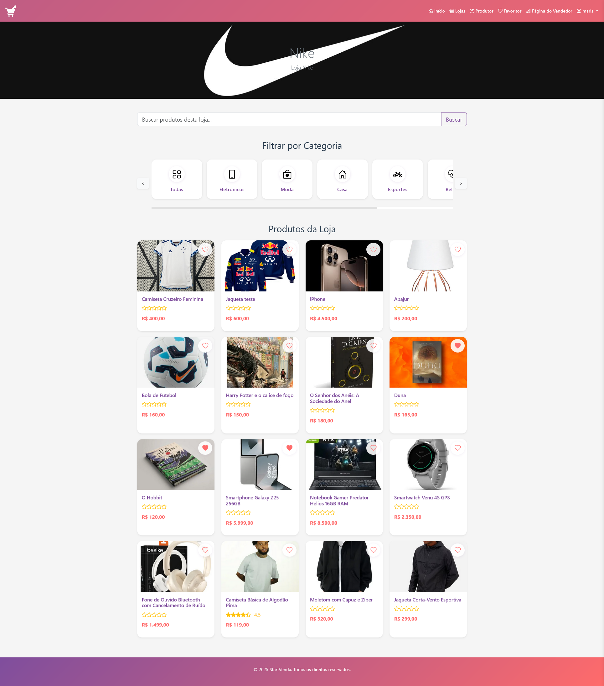

##### Funcionalidade 14 - Responder Perguntas dos Usuários

Permite que o vendedor visualize e responda perguntas feitas por clientes sobre os produtos da loja.

* **Estrutura de dados:** [Perguntas](#estrutura-de-dados---perguntas)
* **Instruções de acesso:**
    * Abra o site e efetue o login
    * Clique em Página do Vendedor na barra de navegação
    * Clique na loja que deseja gerenciar
    * Clique no botão Responder Dúvidas

* **Tela da funcionalidade**:
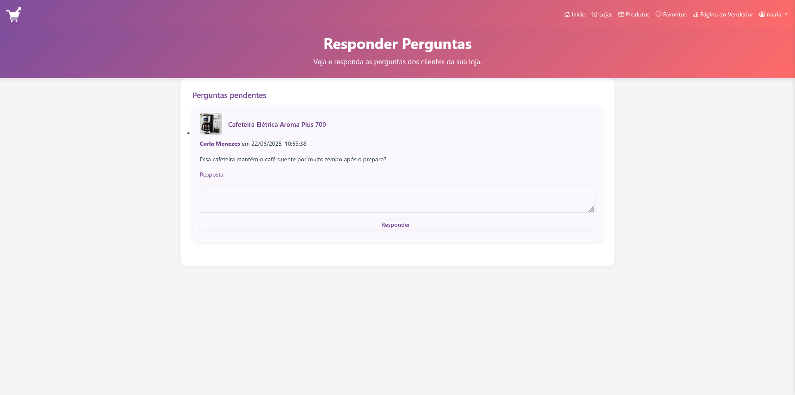

##### Funcionalidade 15 - Alterar Dados do Usuário

Permite que o usuário atualize suas informações de cadastro e senha.

* **Estrutura de dados:** [Usuários](#estrutura-de-dados---usuários)
* **Instruções de acesso:**
    * Abra o site e efetue o login
    * Clique em Minha Conta na barra de navegação
    * Coloque os dados atualizados no formulário e clique em Salvar Alterações

* **Tela da funcionalidade**:

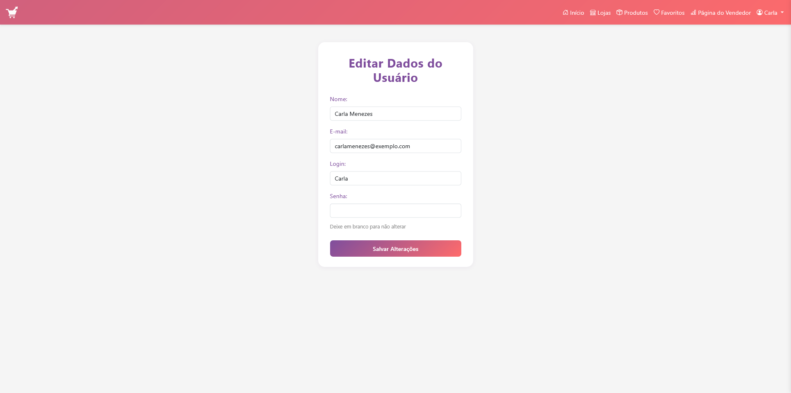

##### Funcionalidade 16 - Tela Inicial

Apresenta os principais produtos, novidades, categorias e lojas em destaque, facilitando a navegação e o acesso rápido às seções da plataforma.

* **Estrutura de dados:** [Produtos](#estrutura-de-dados---produtos) e [Lojas](#estrutura-de-dados---lojas)
* **Instruções de acesso:**
    * Abra o site

* **Tela da funcionalidade**:

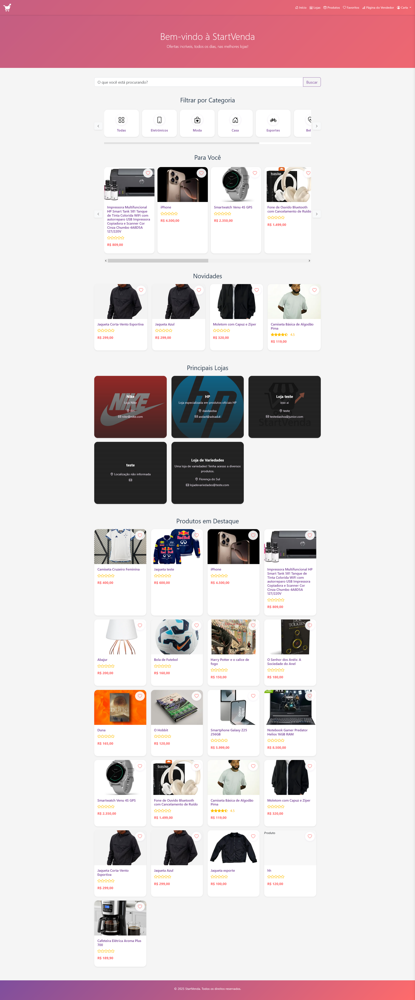


## Estruturas de Dados

Descrição das estruturas de dados utilizadas na solução com exemplos no formato JSON.Info

##### Estrutura de Dados - Usuários

Registro dos usuários do sistema utilizados para login e para o perfil do sistema

```json
   {
      "id": "1",
      "login": "admin",
      "senha": "123",
      "nome": "Administrador do Sistema",
      "email": "admin@abc.com",
      "recomendacao": {
        "eletronicos": 4,
        "moda": 30,
        "casa": 0,
        "esportes": 0,
        "beleza": 0,
        "livros": 1
      }
    }
```

##### Estrutura de Dados - Lojas

Registro das lojas cadastradas no sistema pelos usuários que desejam vender na plataforma.

```json
  {
      "nome": "Nike",
      "url": "/nike",
      "cnpj": "12.345.678/0001-91",
      "id_usuario": 4,
      "id_categoria": 1,
      "descricao": "Loja Nike",
      "url_logo": "url_logo",
      "url_banner": "url_banner",
       "endereco": {
        "rua": "Rua asdasdasdas",
        "numero": "444",
        "complemento": "",
        "bairro": "Bairro ex",
        "cidade": "BH",
        "estado": "MG",
        "cep": "00000000",
        "pais": "BR"
      },
      "contato": {
        "email": "nike@nike.com",
        "telefone": "31000000000",
        "whatsapp": "31000000000"
      },
      "configuracoes": {
        "moeda": "BRL",
        "idioma": "pt-br",
        "fuso_horario": "America/Sao_Paulo",
        "metodo_envio_padrao": "correios",
        "formas_pagamento": [
          "boleto",
          "pix",
          "cartao_credito"
        ]
      },
      "deleted_at": null,
      "id": "1"
  }   
```

##### Estrutura de Dados - Avaliações

Registro de avaliações feitas por usuários em produtos cadastrados pelas lojas. 

```json
   {
    {
      "id_usuario": 4,
      "id_produto": 16,
      "texto": "bom",
      "estrelas": 4,
      "data": "2025-06-15T18:48:51.623Z",
      "id": "0Hbikr8"
    }
   }
```

##### Estrutura de Dados - Produtos

Registro de produtos cadastrados pelas lojas da plataforma.

```json
   {
    {
      "name": "Camiseta Cruzeiro Feminina",
      "price": "400",
      "stock": "10",
      "category_id": "2",
      "id_loja": "1",
      "description": "Camiseta 100% algodão, modelagem feminina, cor branca",
      "images": "url_image",
      "updated_at": "2025-06-13T14:54:19.747Z",
      "id": "1"
    }
   }
```

##### Estrutura de Dados - Pedidos

Registro de pedidos feitos pelos usuários dentro da plataforma.

```json
   {
    {
      "usuarioId": 4,
      "produtosId": [
        2,
        2,
        3
      ],
      "valor_total": 5700,
      "metodo_pagamento": "Dinheiro",
      "status": "em_andamento",
      "data_venda": "2025-06-14",
      "lojaId": 1,
      "id": "2"
    }
   }
```
##### Estrutura de Dados - Favoritos

Registro de produtos adicionados em favoritos pelos usuários.

```json
   {
    {
      "clienteId": 1,
      "produtoId": 16,
      "id": "1"
    }
   }
```

##### Estrutura de Dados - Carrinho

Registro de produtos adicionados no carrinho do usuário em compras.

```json
   {
    {
      "usuarioId": 5,
      "produtoId": 16,
      "quantidade": 1,
      "id": "2"
    }
   }
```

##### Estrutura de Dados - Chats

Registro de mensagens trocadas pelos usuários, cliente e vendedor.

```json
   {
    {
      "pedidoId": 2,
      "mensagens": [
        {
          "remetente": "vendedor",
          "texto": "[MENSAGEM AUTOMÁTICA] Olá! Recebemos seu pedido com os seguintes produtos:\n• Jaqueta teste x2\n• iPhone x1",
          "data": "2025-06-14T15:30:26.487Z"
        },
        {
          "id": 1749915119294,
          "remetente": "comprador",
          "texto": "ja enviou?",
          "data": "2025-06-14T15:31:59.294Z"
        },
        {
          "id": 1749915124136,
          "remetente": "vendedor",
          "texto": "sim",
          "data": "2025-06-14T15:32:04.136Z"
        }
      ],
      "id": "2"
    }
   }
```

##### Estrutura de Dados - Perguntas

Registro de perguntas feitas pelos usuários aos vendedores, sobre os produtos à venda.

```json
   {
    {
      "id_usuario": 4,
      "id_produto": 1,
      "texto": "Tem à pronta entrega?",
      "data": "2025-06-17T12:33:26.862Z",
      "resposta": "Não temos.",
      "id": "5H6oBN7"
    }
   }
```

## Módulos e APIs

Esta seção apresenta os módulos e APIs utilizados na solução

**Fonts:**
* Bootstrap Icons - [https://icons.getbootstrap.com/](https://icons.getbootstrap.com/)

**Scripts:**

* Bootstrap 5 - [http://getbootstrap.com/](http://getbootstrap.com/)

**API's**
* [API Rest](https://bb9fb5e0-b56f-4bc3-8752-7453f1f1ff2a-00-3bk3rcdhbanjz.spock.replit.dev/db)
* ChartJS - [https://www.chartjs.org/](https://www.chartjs.org/)
* OpenAI API - [https://openai.com/index/openai-api/](https://openai.com/index/openai-api/)


# Referências <!--EDITAR-->

As referências utilizadas no trabalho foram:

* ROMMEL, P. *JSONServer*. [S. l.], 2025. Disponível em: https://replit.com/@rommelpuc/JSONServer. Acesso em: 22 jun. 2025.

* SERVIÇO BRASILEIRO DE APOIO ÀS MICRO E PEQUENAS EMPRESAS. Conheça os principais desafios do e-commerce. Portal Sebrae, 2 ago. 2023. Disponível em: <https://sebrae.com.br/sites/PortalSebrae/artigos/conheca-os-principais-desafios-do-e-commerce,e7718e029bf28810VgnVCM1000001b00320aRCRD>. Acesso em: 22 jun. 2025.

* DINO. E-commerce está em crescimento há dez anos. Valor Econômico, São Paulo, 9 abr. 2024. Seção Patrocinada. Disponível em: <https://valor.globo.com/patrocinado/dino/noticia/2024/04/09/e-commerce-esta-em-crescimento-ha-dez-anos.ghtml>. Acesso em: 22  jun. 2025.

